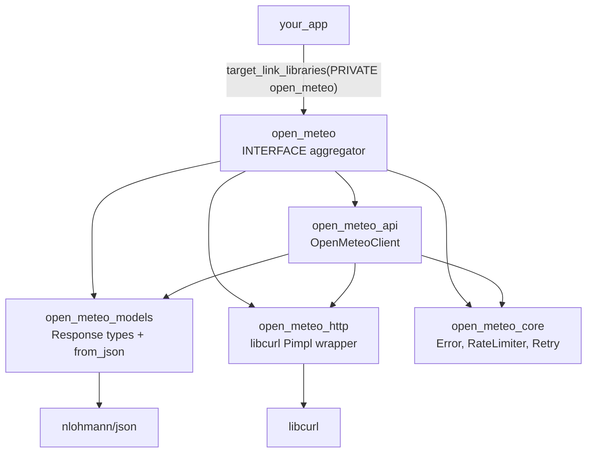
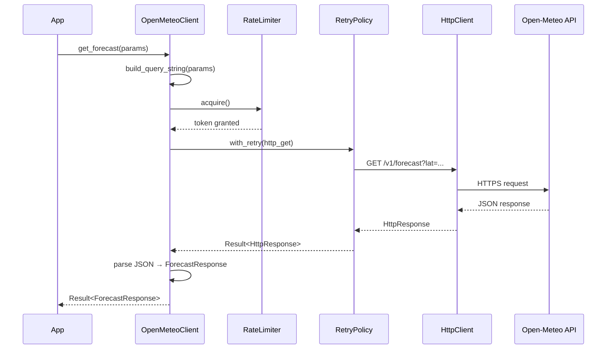

# open-meteo-cpp

C++23 SDK for the [Open-Meteo](https://open-meteo.com/) weather API.

Modern, type-safe client covering all 12 Open-Meteo endpoints with `std::expected` error handling, built-in rate limiting, retry with exponential backoff, and both JSON and FlatBuffers response support.

## Quick Start

```cpp
#include <open_meteo/open_meteo.hpp>
#include <iostream>

int main() {
    open_meteo::OpenMeteoClient client;

    open_meteo::ForecastParams params;
    params.latitude = 40.7128;
    params.longitude = -74.0060;
    params.hourly = {"temperature_2m", "precipitation", "wind_speed_10m"};
    params.forecast_days = 3;
    params.temperature_unit = open_meteo::TemperatureUnit::Fahrenheit;

    auto result = client.get_forecast(params);
    if (!result) {
        std::cerr << "Error: " << result.error().message << std::endl;
        return 1;
    }

    auto& forecast = *result;
    std::cout << "Location: " << forecast.latitude << ", " << forecast.longitude << std::endl;
    std::cout << "Timezone: " << forecast.timezone << std::endl;

    if (forecast.hourly) {
        auto& temps = forecast.hourly->values.at("temperature_2m");
        auto& times = forecast.hourly->time;
        for (size_t i = 0; i < std::min(times.size(), size_t{5}); ++i) {
            std::cout << times[i] << ": " << temps[i] << "°F" << std::endl;
        }
    }
}
```

## Features

- **C++23** with `std::expected<T, Error>` — no exceptions in the public API
- **All 12 endpoints**: Forecast, Historical Weather, Historical Forecast, Previous Runs, Ensemble, Marine, Air Quality, Climate, Seasonal Forecast, Flood, Elevation, Geocoding
- **Rate limiting**: Token bucket (configurable, defaults to 600 req/min for free tier)
- **Retry**: Exponential backoff with jitter for transient failures (429, 5xx)
- **Type-safe parameters**: Strongly typed enums for units, cell selection, models
- **Pimpl pattern**: Stable ABI, fast compilation
- **Move-only client**: Efficient resource management
- **Commercial API support**: Optional API key + customer endpoint switching
- **Thread-safe rate limiter**: Safe for concurrent use

## Building

### Requirements

- C++23 compiler (GCC 13+, Clang 17+, MSVC 19.38+)
- CMake 3.20+
- libcurl development headers

### Build

```bash
make build        # Release build
make test         # Run tests
make lint         # Check formatting (requires clang-format)
make format       # Apply formatting
make clean        # Clean build artifacts
```

### CMake Options

| Option | Default | Description |
|--------|---------|-------------|
| `OPEN_METEO_BUILD_TESTS` | ON | Build unit tests |
| `OPEN_METEO_BUILD_EXAMPLES` | ON | Build example programs |
| `OPEN_METEO_ENABLE_LTO` | ON | Link-time optimization |
| `OPEN_METEO_NATIVE_ARCH` | OFF | Use `-march=native` |
| `OPEN_METEO_ENABLE_SANITIZERS` | OFF | ASan + UBSan |

## Using as a Dependency

### CMake FetchContent

```cmake
include(FetchContent)
FetchContent_Declare(open_meteo_cpp
    GIT_REPOSITORY https://github.com/Reddimus/open-meteo-cpp.git
    GIT_TAG v0.1.0
    GIT_SHALLOW TRUE
)
set(OPEN_METEO_BUILD_TESTS OFF CACHE BOOL "" FORCE)
set(OPEN_METEO_BUILD_EXAMPLES OFF CACHE BOOL "" FORCE)
FetchContent_MakeAvailable(open_meteo_cpp)

target_link_libraries(your_app PRIVATE open_meteo)
```

## API Coverage

| Endpoint | Method | Status |
|----------|--------|--------|
| [Forecast](https://open-meteo.com/en/docs) | `get_forecast()` | ✅ |
| [Historical Weather](https://open-meteo.com/en/docs/historical-weather-api) | `get_historical_weather()` | ✅ |
| [Historical Forecast](https://open-meteo.com/en/docs/historical-forecast-api) | `get_historical_forecast()` | ✅ |
| [Previous Runs](https://open-meteo.com/en/docs/previous-runs-api) | `get_previous_runs()` | ✅ |
| [Ensemble](https://open-meteo.com/en/docs/ensemble-api) | `get_ensemble()` | ✅ |
| [Marine](https://open-meteo.com/en/docs/marine-weather-api) | `get_marine()` | ✅ |
| [Air Quality](https://open-meteo.com/en/docs/air-quality-api) | `get_air_quality()` | ✅ |
| [Climate](https://open-meteo.com/en/docs/climate-api) | `get_climate()` | ✅ |
| [Seasonal Forecast](https://open-meteo.com/en/docs/seasonal-forecast-api) | `get_seasonal_forecast()` | ✅ |
| [Flood](https://open-meteo.com/en/docs/flood-api) | `get_flood()` | ✅ |
| [Elevation](https://open-meteo.com/en/docs/elevation-api) | `get_elevation()` | ✅ |
| [Geocoding](https://open-meteo.com/en/docs/geocoding-api) | `search_location()` | ✅ |

## Examples

```bash
make run-forecast          # 3-day NYC forecast
make run-historical        # ERA5 historical data
make run-geocoding         # Location search
make run-air-quality       # Air quality data
```

## Architecture



### Request Flow



## Dependencies

| Library | Purpose | Integration |
|---------|---------|-------------|
| [libcurl](https://curl.se/libcurl/) | HTTP client | System (`find_package`) |
| [nlohmann/json](https://github.com/nlohmann/json) | JSON parsing | FetchContent |
| [GoogleTest](https://github.com/google/googletest) | Testing | FetchContent |

## Rate Limits (Free Tier)

| Limit | Value |
|-------|-------|
| Daily | 10,000 API calls |
| Hourly | 5,000 API calls |
| Per minute | 600 API calls |

The SDK automatically respects these limits via the built-in token bucket rate limiter. For commercial use with an API key, rate limiting can be disabled or adjusted.

## References

- [Open-Meteo API Documentation](https://open-meteo.com/en/docs) — Official API reference for all endpoints
- [Open-Meteo SDK Repository](https://github.com/open-meteo/sdk) — FlatBuffers schemas and official SDK bindings
- [Open-Meteo Pricing & Rate Limits](https://open-meteo.com/en/pricing) — Free tier limits and commercial plans
- [ERA5 Reanalysis](https://www.ecmwf.int/en/forecasts/dataset/ecmwf-reanalysis-v5) — Historical weather data source (1940-present)
- [nlohmann/json](https://github.com/nlohmann/json) — JSON parsing library used by this SDK
- [libcurl](https://curl.se/libcurl/) — HTTP client library used by this SDK

## License

[MIT](LICENSE.md)
